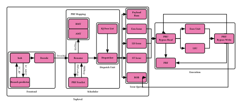

RV32 Project implemented using Chisel
=======================

### Dependencies
#### JDK 11 or newer

We recommend using Java 11 or later LTS releases. While Chisel itself works with Java 8, our preferred build tool Mill requires Java 11. You can install the JDK as your operating system recommends, or use the prebuilt binaries from [Adoptium](https://adoptium.net/) (formerly AdoptOpenJDK).

#### SBT or mill

SBT is the most common build tool in the Scala community. You can download it [here](https://www.scala-sbt.org/download.html).  
mill is another Scala/Java build tool without obscure DSL like SBT. You can download it [here](https://github.com/com-lihaoyi/mill/releases)

By default, Mill will be automatically downloaded to local directory on first run, human intervention not required.

#### Verilator

#### Justfile

For the convenience of cross-platform, we are using justfile in place of makefile. For installation for various platforms (Linux/MacOS/Windows), see [here](https://github.com/casey/just). It is recommended to use it as as makefile is not readily available on windows.

#### Typst

The spec document is generated using *typst*, and the code is automatically read from the codebase and updated accordingly in the document. Typst is needed for doc compilation.

### Design Schematics


### Performing chisel based tests
```sh
just test
```

### Execute the cpu
```sh
just run
```

### Generating Spec File
Generation will be done with github actions. But you can do it locally on your machine by:
```sh
typst compile spec.typ
```
or
```sh
just spec
```

### Project Directory Structure
| Path | Remark |
|------|--------|
| [src/](./src)   |   Chisel source code |
| [bench.cpp](./bench.cpp)   |   Test benchmark program |
| [doc/spec.typ](./doc/spec.typ)   |    Specifications for the implementation of our RV32   |
| [doc/spec.pdf](./doc/spec.pdf)   |    Generated specifications for the implementation of our RV32   |
| [justfile](./justfile) | Similar to that of Makefile, provides ease of access to commonly used commands |

### Remark
+ justfile: Currently on linux, mill is automatically fetched when test is run.

### Work Distribution

| Member | Part |
|------|--------|
| 刘恒雨(组长) | 顶层模块+测试+文档排布+优化代码(dispatch)+branch_mask+csr |
| 杨钧铎 | ROB + Rename |
| 饶忠禹 | LSU |
| 胡英瀚 | Issue Queue |
| 李可名/赵力 | BP |
| 邢益成 | Fetch + Decode |
| 马嘉一 | FU(ALU BP DIV MUL) |
| 胡继仁 | prf |
| 蔡家麒 | RAS |
